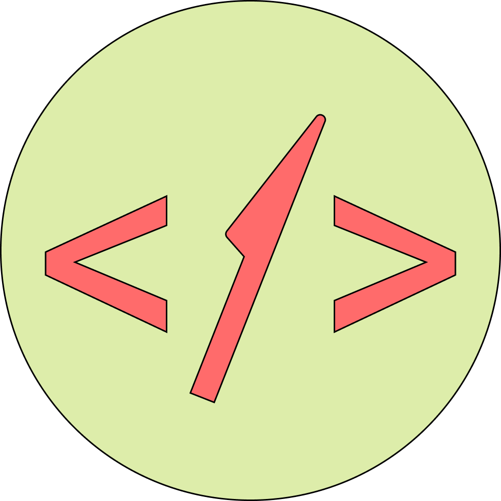

# Reciplease

A web application built with React, Python Flask, Tensorflow, and the Spoonacular and Barcode Monster APIs, Reciplease aims to reduce food waste by giving users recipe ideas based on the ingredients they have. 

## Preface
Reciplease was designed and developed by <a href="https://github.com/isabellaenriquez">Isabella Enriquez</a>, <a href="https://github.com/c-kip">Callum Kipin</a>, <a href="https://github.com/jessicaa-li">Jessica Li</a>, and <a href="https://github.com/mkevinq">Marc Kevin Quijalvo</a> at Hack Western 7, a 36-hr hackathon, from November 20 to November 22.

## About
Food waste is a huge issue in Canada, and it's right under our noses. In 2017, the National Zero Waste Council reported that an astonishing 63% of the food thrown out by Canadians could have been eaten. For the average Canadian household, that's about 140 kilograms of wasted food per year, or more than $1,100 per year! Nationwide, that 63% amounts to about 2.2 million tonnes of wasted food every year, that could have been avoided, totaling up to a whole $17 billion!

Reciplease aims to minimize these numbers. Using Reciplease, users can input the ingredients already in their fridges and pantries, and receive recipes based on the ingredients. Not only does Reciplease help people reduce their food waste, it also ends the tedious task of deciding what to eat, giving users a plethora of ideas. 
